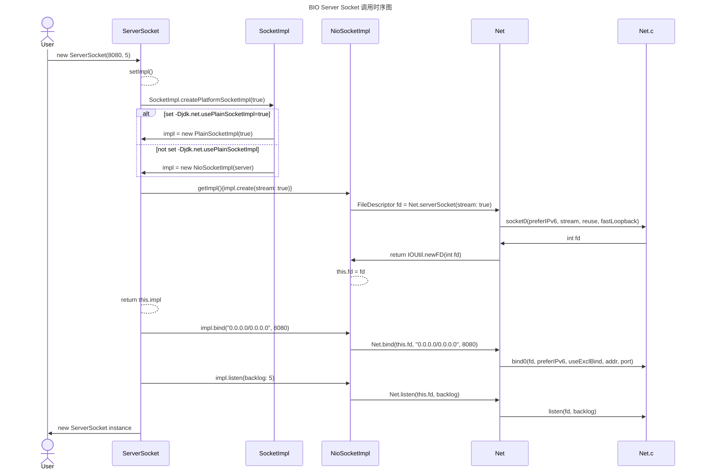

内核 网络 IO


马士兵-周志垒老师《从TCP/IP，理解BIO、NIO、多路复用》课程笔记

1、OSI7层网络模型介绍

从低到高依次是：物理层、数据链路层、网络层、传输层、会话层、表示层、应用层

2、TCP/IP4层网络模型

从低到高依次是：数据链路层、网络层、传输层、应用层

关于各层的详细作用以及OSI和TCP/IP的对比分析并非本次的重点，本次是想通过网络模型作为切入点，提出一个问题。

平时编写的Java网络应用处于网络模型中的哪一层？答案是应用层，那么传输层及以下的层是谁实现的？

答案是操作系统内核。

### 实验案列

```shell
# 利用IO手动创建网络连接发送和接收数据的小实验
ll /proc/$$/fd
# 建立连接
exec 8<> /dev/tcp/www.baidu.com/80
# 向连接写入数据
echo -e 'GET / HTTP/1.0\n\n' >& 8
# 接收数据
cat <& 8
# 关闭连接
exec 8<& -
```

通过这样一个小实验可知，应用程序是通过IO与内核交互，由内核完成实际的数据发送与接收。所以熟悉IO、和内核对于程序员有重要意义。

我们通常听说过，TCP是面向连接的可靠传输协议。那么到底什么是**连接**呢？TCP又为什么可靠呢？带着这样的问题做接下来的实验。

```shell
# 先打开一个终端，叫tty1，输入如下指令：
tcpdump -nn -i eth0 host www.baidu.com
# 再打开一个终端，叫tty2，输入如下指令：
curl www.baidu.com
# 然后可以在tty1中观察到类似如下的输出：
tcpdump: verbose output suppressed, use -v or -vv for full protocol decode
listening on eth0, link-type EN10MB (Ethernet), capture size 262144 bytes
16:47:10.048106 IP 172.17.43.138.52898 > 180.101.50.242.80: Flags [S], seq 148439528, win 29200, options [mss 1460,sackOK,TS val 1177771823 ecr 0,nop,wscale 7], length 0
16:47:10.063425 IP 180.101.50.242.80 > 172.17.43.138.52898: Flags [S.], seq 4184912591, ack 148439529, win 8192, options [mss 1452,sackOK,nop,nop,nop,nop,nop,nop,nop,nop,nop,nop,nop,wscale 5], length 0
16:47:10.063457 IP 172.17.43.138.52898 > 180.101.50.242.80: Flags [.], ack 1, win 229, length 0
# 上面就是3次握手的过程
16:47:10.063659 IP 172.17.43.138.52898 > 180.101.50.242.80: Flags [P.], seq 1:78, ack 1, win 229, length 77: HTTP: GET / HTTP/1.1
16:47:10.079171 IP 180.101.50.242.80 > 172.17.43.138.52898: Flags [.], ack 78, win 908, length 0
16:47:10.080068 IP 180.101.50.242.80 > 172.17.43.138.52898: Flags [P.], seq 1:1441, ack 78, win 908, length 1440: HTTP: HTTP/1.1 200 OK
16:47:10.080078 IP 172.17.43.138.52898 > 180.101.50.242.80: Flags [.], ack 1441, win 251, length 0
16:47:10.080085 IP 180.101.50.242.80 > 172.17.43.138.52898: Flags [P.], seq 1441:2782, ack 78, win 908, length 1341: HTTP
16:47:10.080089 IP 172.17.43.138.52898 > 180.101.50.242.80: Flags [.], ack 2782, win 274, length 0
16:47:10.080217 IP 172.17.43.138.52898 > 180.101.50.242.80: Flags [F.], seq 78, ack 2782, win 274, length 0
16:47:10.089536 IP 180.101.50.242.80 > 172.17.43.138.52898: Flags [P.], seq 1441:2782, ack 78, win 908, length 1341: HTTP
16:47:10.089573 IP 172.17.43.138.52898 > 180.101.50.242.80: Flags [.], ack 2782, win 274, options [nop,nop,sack 1 {1441:2782}], length 0
16:47:10.095643 IP 180.101.50.242.80 > 172.17.43.138.52898: Flags [.], ack 79, win 908, length 0
16:47:10.095701 IP 180.101.50.242.80 > 172.17.43.138.52898: Flags [F.], seq 2782, ack 79, win 908, length 0
16:47:10.095719 IP 172.17.43.138.52898 > 180.101.50.242.80: Flags [.], ack 2783, win 274, length 0
16:47:13.115932 IP 180.101.50.242.80 > 172.17.43.138.52898: Flags [R], seq 4184915374, win 0, length 0
```

然后，我们来回答上面的问题，什么是连接？连接并不是真的有一根线连接着双方。所以，tcp3次握手后，就会在双方的内核空间开辟一片内存空间，存储我的ip:port <-->对方的ip:port，这样的信息有一个官方的抽象Socket。因为对于类UNIX系统而言，所有都是文件，所以创建连接或者说在内核空间中创建Socket对象后，会有一个指向它的文件描述符fd，上层应用程序持有fd，通过fd操作Socket发送和接收数据。可通过如下方式查看这个Socket。

```shell
netstat -natp
# 命令的输出：
Active Internet connections (servers and established)
Proto Recv-Q Send-Q Local Address           Foreign Address         State       PID/Program name
tcp        0      0 0.0.0.0:22              0.0.0.0:*               LISTEN      942/sshd
tcp        0      0 0.0.0.0:5355            0.0.0.0:*               LISTEN      898/systemd-resolve
tcp        0      0 172.17.43.138:22        39.144.38.45:35744      ESTABLISHED 1008/sshd: root [pr
tcp        0      0 172.17.43.138:53378     100.100.45.106:443      TIME_WAIT   -
tcp        0     36 172.17.43.138:22        39.144.38.45:36090      ESTABLISHED 1299/sshd: root [pr
tcp        0      0 172.17.43.138:33318     100.100.30.26:80        ESTABLISHED 1058/AliYunDun
tcp        0      0 172.17.43.138:22        39.144.38.45:36086      ESTABLISHED 1190/sshd: root [pr
tcp        0      0 172.17.43.138:22        39.144.38.45:36088      ESTABLISHED 1242/sshd: root [pr
tcp6       0      0 :::5355                 :::*                    LISTEN      898/systemd-resolve


ss -at
# 命令的输出
State            Recv-Q        Send-Q                 Local Address:Port                      Peer Address:Port
LISTEN           0             128                          0.0.0.0:ssh                            0.0.0.0:*
LISTEN           0             128                          0.0.0.0:hostmon                        0.0.0.0:*
ESTAB            0             0                      172.17.43.138:ssh                       39.144.38.45:35744
TIME-WAIT        0             0                      172.17.43.138:53384                   100.100.45.106:https
ESTAB            0             36                     172.17.43.138:ssh                       39.144.38.45:36090
ESTAB            0             0                      172.17.43.138:33318                    100.100.30.26:http
ESTAB            0             0                      172.17.43.138:ssh                       39.144.38.45:36086
ESTAB            0             0                      172.17.43.138:ssh                       39.144.38.45:36088
LISTEN           0             128                             [::]:hostmon                           [::]:*
```

使用Java新建一个ServerSocket后，没有执行accept()之前

此时也是可以通过`nc localhost 8080`连接的

此时通过`ss -na`命令查看到的

`recv-Q`是缓冲的没有被应用程序accept的连接数

`send_Q`是backlog，表示能缓冲多少个没被应用程序accept的连接

应用程序accept后，通过`netstat -natp`查看到的 `recv-Q`和`send_Q`就是缓冲数据的


java.net.ServerSocket#ServerSocket(int, int, java.net.InetAddress)

java.net.SocketImpl#createPlatformSocketImpl

根据是否存在`jdk.net.usePlainSocketImpl`属性，创建SocketImpl的子类，

对于jdk17的源码：没有属性时，创建NioSocketImpl，否则创建PlainSocketImpl





